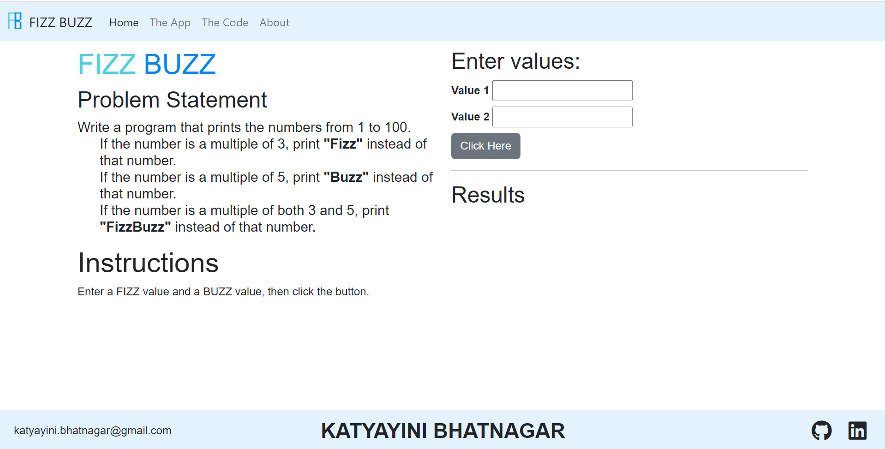

# FIZZ BUZZ Challenge

## Description

Fizz Buzz is a traditional coding challenge. 

In this application, a loop runs from 1 to 100.
If the number is a multiple of 3, then "Fizz" is printed instead of that number.
If the number is a multiple of 5, then "Buzz" is printed instead of that number.
If the number is a multiple of both 3 and 5, then "FizzBuzz" is printed instead of that number.

The application is created using HTML, CSS, JavaScript, DOM Manipulation, Bootstrap and jQuery.

## Screenshots
 

## Link to deployed application

